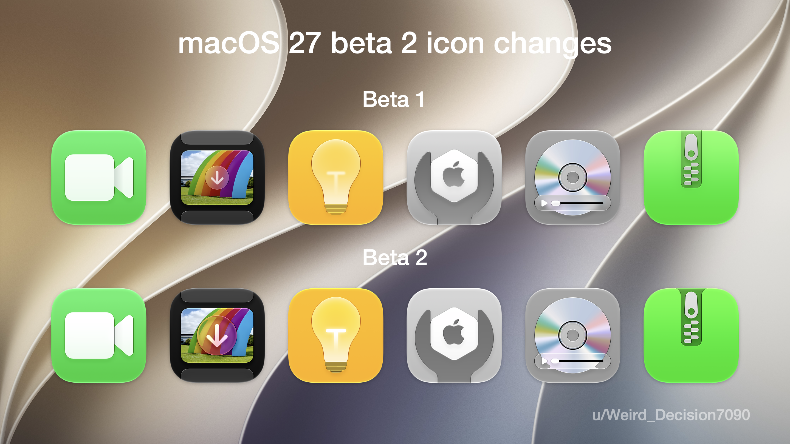
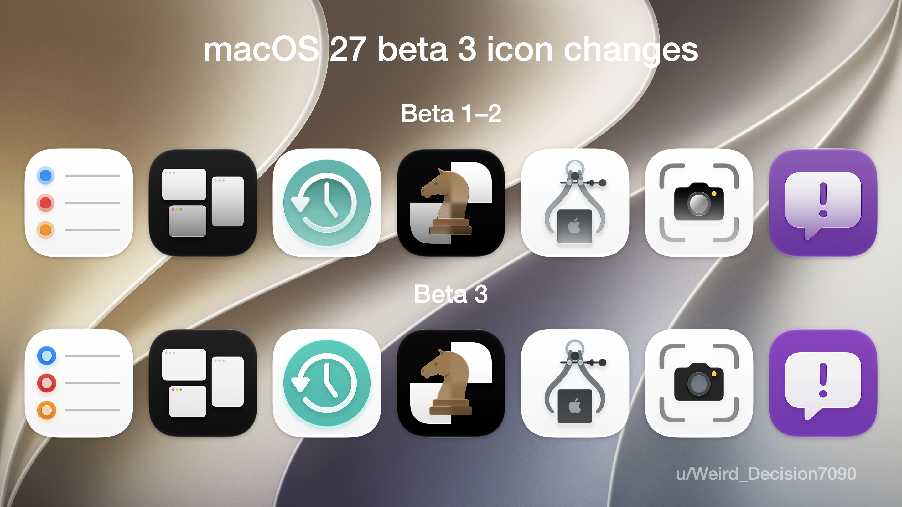
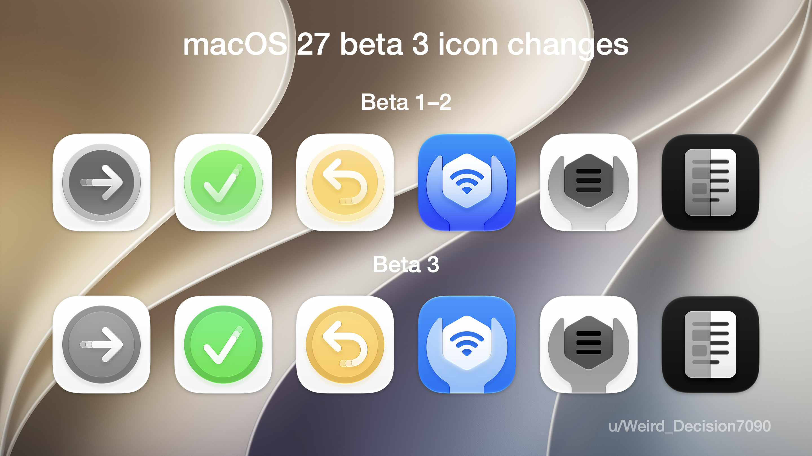

# macOS 27 Icons

This includes all macOS 27 icons exported from my MacBook Air as PNGs, in original 1024x1024 resolution. I even included CoreServices and other apps. 19 icons have changed as of beta 3, so I documented those changes, where other resouces don't. Here are images of the changes:

[YouTube Channel](https://youtube.com/@prfmzagnut)

[Buy Me A Coffee](https://buymeacoffee.com/gabrielev)
