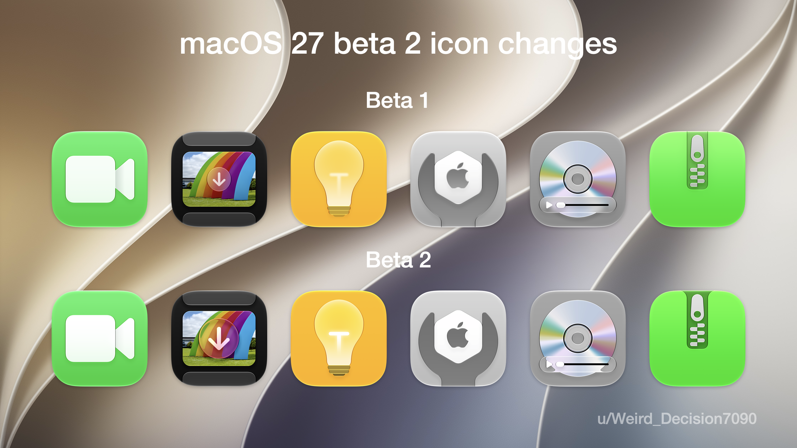
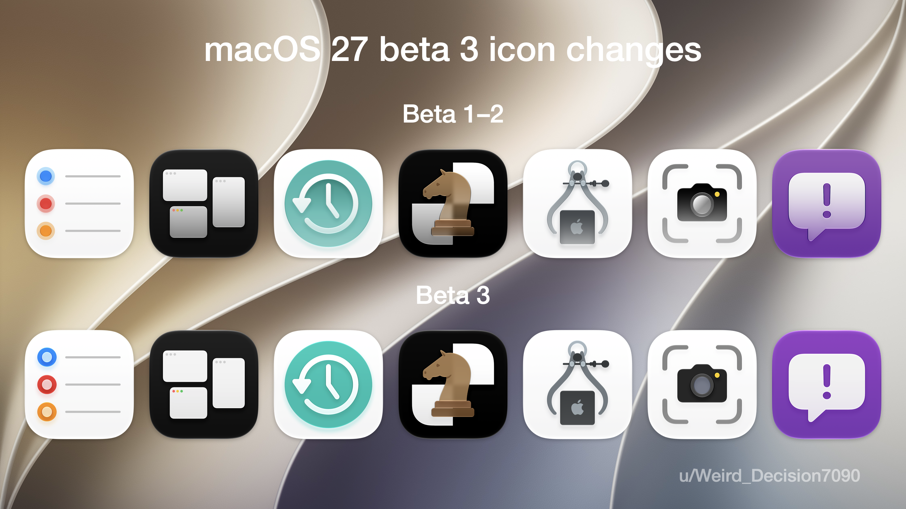
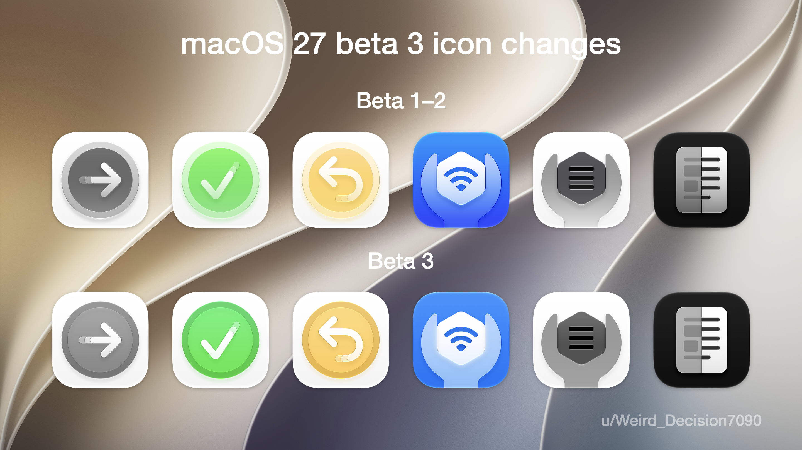

# macOS 27 Icons

This repo includes all macOS 27 icons exported from my MacBook Air as PNGs, in original 1024x1024 resolution. I even include CoreServices and other apps.

## Changelog

### Beta 3: reduced outlines
* Reminders
* Mission Control
* Time Machine
* Chess
* System Information
* Screenshot
* Feedback Assistant
* Migration Assistant
* Setup Assistant
* Erase Assistant
* Wireless Diagnostics
* Expansion Slot Utility
* Accessibility Reader
* Everything else (minor)

### Beta 4: more shadows
* App Store
* Audio MIDI Setup
* Console
* Game Center
* Terminal
* Everything else (minor)

### Beta 5: less shadows, more 3D and gradients
* App Store
* Apple Diagnostics
* Books
* Preview (iOS)
* Remote (iOS)
* Safari
* Screen Sharing
* (System) Settings
* Siri
* Everything else (minor)

19 icons have changed (majorly) as of beta 3, so I documented those changes, where other resouces don't. All icons changed in beta 3, toning down the outlines, but here are images of the major changes:

[YouTube Channel](https://youtube.com/@prfmzagnut)

[Buy Me A Coffee](https://buymeacoffee.com/gabrielev)
